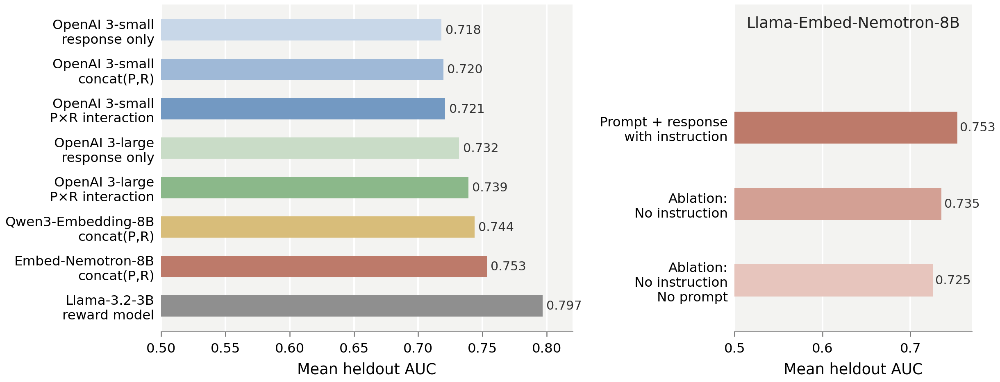

# What's In My Human Feedback (WIMHF)

WIMHF learns human-interpretable concepts from preference datasets in four steps:
- encode response texts using an embedding model,
- train a sparse autoencoder (SAE) on the difference in response embeddings across all preference pairs,
- interpret each SAE feature using an LLM (OpenAI or vLLM),
- identify features that predict preference labels.

**Links:** [Paper](https://arxiv.org/abs/2510.26202) · [Demo](https://rajivmovva.com/demo-wimhf/) · [Code](https://github.com/rmovva/wimhf) · [Data](https://huggingface.co/datasets/rmovva/wimhf-data)

Read the preprint for full details: [What’s In My Human Feedback? Learning Interpretable Descriptions of Preference Data](https://arxiv.org/abs/2510.26202) by Rajiv Movva, Smitha Milli, Sewon Min, and Emma Pierson.

## Quickstart

1. **Clone & install**
   ```bash
   git clone https://github.com/rmovva/wimhf.git
   cd wimhf
   pip install -e .
   ```
2. **Configure credentials**  
   Export your OpenAI-compatible key once per shell:
   ```bash
   export OAI_WIMHF=sk-your-key
   ```
   Local LLM inference is supported through `vllm`/`sentence-transformers`; skip the key if you only use those paths.
3. **Prepare a dataset config** *(CLI path)*  
   Copy one of the JSON files in `configs/` and point it at your dataset (see schema below). You can then run:
   ```bash
   python scripts/run_wimhf.py configs/community_align.json --output-dir outputs/community_align
   ```
4. **Open the notebook** *(interactive path)*  
   Alternatively, use `notebooks/community_alignment_quickstart.ipynb` for an end-to-end walkthrough that mirrors the same dataclasses while letting you inspect intermediate artefacts.

## Dataset schema

Provide a table (Parquet/JSON/CSV) with at least the following columns:
- `prompt`: text shown to both models/annotators,
- `response_A`, `response_B`: the two candidate completions,
- `label`: binary or {0, 1} preference target (1 means `response_A` preferred).  

Optional columns include `conversation_id`, `split_columns` for connected-component train/val splits, and derived statistics like `length_delta`. The quickstart utilities will compute `length_delta` automatically if it is missing.

See `configs/*.json` for concrete settings used in the WIMHF paper; each config mirrors the dataclasses in `wimhf.quickstart`.

## API keys and LLM usage

Remote interpretation, annotation, and embedding calls expect the environment variable `OAI_WIMHF`. The library now reads **only** this key to initialise the OpenAI client. Local inference routes are available through:
- `wimhf.llm_local` (via `vllm`) for decoder-only models,
- `wimhf.embedding.get_local_embeddings` (via `sentence-transformers`) for offline embeddings.

Set `CUDA_VISIBLE_DEVICES` when running local models if multiple GPUs are present.

## Updated Embedder Models

**tl;dr:** In the paper, we used OpenAI text-embedding-3-small as our embedding model, and we computed embeddings of the response only. We now recommend using `llama-embed-nemotron-8b` or `qwen3-embedding-8b` (or similar models of a newer generation), and embedding with an instruction followed by the prompt and the response. We recommend running these embedding models in `vLLM` instead of `sentence-transformers` for better performance.



The above figure shows the mean AUC, across 7 datasets, of a linear probe fit on `emb(prompt, response A) - emb(prompt, response B)` to predict the preference label (WLOG 1 if A preferred, 0 if B). Here are some key takeaways from the figure:
1. (Left panel) Comparing rows 1-3, we see that for OpenAI's small embedding model, incorporating the prompt does not substantially affect AUC. Since we used these embeddings in the paper, we concluded that prompts didn't help much and excluded them.
2. (Left panel) `Qwen3-Embedding-8B` and `Llama-Embed-Nemotron-8B` work much better than what we used in the paper - compared to the full blackbox Llama-3.2 reward model, these embedders capture 85.2% of the AUC gain over random AUC. This is cool because all of the information these models use is stored in a single vector that we can fit an SAE on. In contrast, the reward model's representations are difficult to interpret in our experience. (Caveat: we haven't run the full WIMHF pipeline with all of our downstream evals on these vectors, but informally they seem to work better.)
3. (Right panel) Some ablations showing that (a) including an instruction actually helps the embedding capture more salient information, and (b) including the prompt also captures salient information as opposed to just using the response.

For a single prompt-response interaction, here is the specific string that we embed using Qwen/Nemotron. These embedding models are trained to be instruction-aware, and the above ablation demonstrates that including the instruction actually helps a bit. 

```
Represent this user-assistant exchange for predicting which assistant response humans would prefer, focusing on helpfulness, correctness, harmlessness, relevance, and style.

User: {prompt}

Assistant: {response}
```

As in the paper, we compute the embedding of the above string for both response A and response B, then use the difference in these embeddings to train the preference prediction probe.

Fitting a linear probe on these new embeddings brings AUC closer to a full reward model. Here is the full table of heldout preference prediction AUC for each of the 7 datasets from the paper:

| Method | ChatbotArena | HH-RLHF | PKU | Reddit | PRISM | Tulu | CommunityAlign |
|---|---:|---:|---:|---:|---:|---:|---:|
| OpenAI `text-embedding-3-small`, response only | 0.702 | 0.647 | 0.758 | 0.770 | 0.664 | 0.741 | 0.710 |
| OpenAI `text-embedding-3-small`, concat(P,R) | 0.713 | 0.645 | 0.774 | 0.762 | 0.687 | 0.740 | 0.715 |
| OpenAI `text-embedding-3-small`, P×R interaction | 0.704 | 0.674 | 0.768 | 0.773 | 0.666 | 0.749 | 0.713 |
| OpenAI `text-embedding-3-large`, response only | 0.708 | 0.669 | 0.781 | 0.802 | 0.673 | 0.768 | 0.722 |
| OpenAI `text-embedding-3-large`, P×R interaction | 0.710 | 0.693 | 0.789 | 0.806 | 0.676 | 0.775 | 0.724 |
| `Qwen/Qwen3-Embedding-8B`, instructed concat(P,R) | 0.701 | 0.702 | 0.821 | 0.784 | 0.685 | 0.776 | 0.736 |
| `nvidia/llama-embed-nemotron-8b`, instructed concat(P,R) | 0.711 | 0.700 | 0.843 | 0.808 | 0.696 | 0.796 | 0.720 |
| `nvidia/llama-embed-nemotron-8b`, response only, no instruction | 0.699 | 0.663 | 0.775 | 0.781 | 0.665 | 0.772 | 0.723 |
| `nvidia/llama-embed-nemotron-8b`, prompt-response, no instruction | 0.703 | 0.659 | 0.804 | 0.772 | 0.690 | 0.795 | 0.725 |
| Fine-tuned `Llama-3.2-3B` reward model | 0.716 | 0.789 | 0.884 | 0.833 | 0.722 | 0.864 | 0.769 |

## Citation

If you use this code, please cite:

> What’s In My Human Feedback? Learning Interpretable Descriptions of Preference Data. Rajiv Movva, Smitha Milli, Sewon Min, and Emma Pierson. arXiv:2510.26202.

```
@misc{movva_wimhf_2025,
  title         = {What's In My Human Feedback? Learning Interpretable Descriptions of Preference Data},
  author        = {Rajiv Movva and Smitha Milli and Sewon Min and Emma Pierson},
  year          = {2025},
  eprint        = {2510.26202},
  archivePrefix = {arXiv},
  primaryClass  = {cs.CL},
  url           = {https://arxiv.org/abs/2510.26202}
}
```
